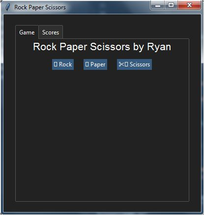

# Rock Paper Scissors Game

A simple Rock Paper Scissors game implemented using Python and the Tkinter library.

## Description

This repository contains a Python program that lets you play the classic Rock Paper Scissors game against an AI opponent. The game's graphical user interface (GUI) is built using the Tkinter library and TTkBootstrap Library for Styling.

## Features

- Play Rock Paper Scissors against the AI.
- Keep track of user and AI wins.
- Switch between the game and scores tabs.

## Requirements

- Python 3.x
- Tkinter library
- TTkBootstrap

## Usage

1. Clone the repository to your local machine:

```shell
git clone https://github.com/RyanGamingYT/rock-paper-scissors.git
```
2. Navigate to the project directory:
```shell
cd rock-paper-scissors
```
3. Install the dependencies:
```bash
pip install -r requirements.txt
```
4. Run the game:
```shell
python game.py
```
## Screenshots
#### Gameplay:

#### Scores:

